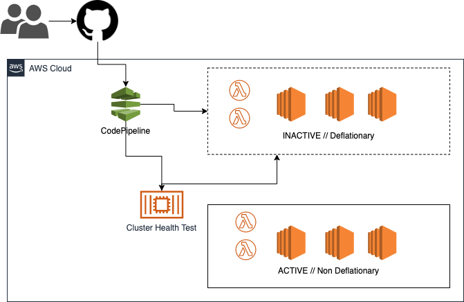
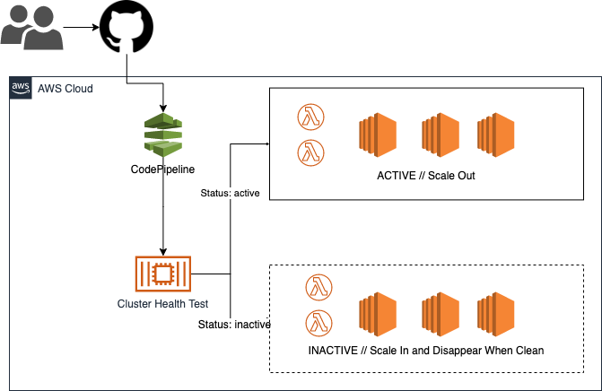

[](https://drone.kloudcover.com/ktruckenmiller/ecs-cluster-deployer)


## ECS Cluster Deployer

> "So, it's like a poor man's ECS Fargate?" - [DRue](https://github.com/danrue)

Deploy and manage [dirt cheap](#cost-comparison) ECS clusters and save yourself the time, money, and engineering effort it takes learning and deploying [Kubernetes](#hitler-deploys-kubernetes).

- [About](#about)
  - [Why?](#why?)
- [Installation and Configuration](#installation-and-configuration)
  - [Pre-Requisites](#pre-requisites)
  - [Installation](#installation)
  - [Configuration](#configuration)
- [Contributing](#contributing)
- [Faq](#faq)
- [Tool Internals](#what-does-this-tool-actually-do)
  - [CodePipeline](#codepipelin)
  - [Deployment](#deployment)
  - [AMI](#ami)
  - [Auto Scaling](#auto-scaling)
  - [Smoke Test](#smoke-test)
  - [EC2 ASG](#ec2-asg)
  - [Mounts](#mounts)
  - [Clean Up](#clean-up)
- [What Does This Tool Not Do?](#what-does-this-tool-not-do)


## About

- Do you like deploying containers to production with 100% uptime?
- Do you like having more [money](#cost-comparison)?
- Do you like having more time?

Then you'll love using the ECS Cluster Deployer.

### Why?

Most organizations and engineers spend a lot of time underestimating the full lifecycle of a cloud resources. AMI updates, rollbacks, de-provisioning, scaling, metrics, and deployment tooling all take engineering time within a given container scheduler. What if you could just do away with all of that nonsense and have a Fargate-esque experience but also have control over your compute parameters? What if you could save [80% off](#cost-comparison) of your compute costs to boot?!

I started this project because I was running 20 wordpress sites, 2 rails applications, and a couple of node apps. It wasn't cheap, and Docker Cloud was dying. I got sick of dealing with HA Proxy going down, my hand rolled Let's Encrypt automation failing, my database crashing, and trying to figure out how to roll my clusters with zero downtime to my customers.

After much thought, I realized that AWS had made some key improvements that made this all possible. They had services for all these things that could reduce my costs but more importantly, these services could reduce the time I spent dealing with production issues, and would allow me to increase the time I spend with my family.

This is how I wanted to move forward:

- place all my containers into spot instances saving me 80% and letting my reserved instances expire because I didn't need them anymore
- use ACM and get rid of the headache of running Let's Encrypt for each service
- use one ALB (application load balancer) for all my services
- use EFS for my network attached file system because Wordpress sucks and needs state in two places and I still need high availability
- use RDS for my databases instead of my db servers going down or being slow on a shared platform
- use ECS for deployments and managing application availability
- use ECS for cron job containers that run my backup tasks for me

This new paradigm has given me 100% uptime for 2 years running, and honestly was the most fun I've had with a platform in awhile.

This project aims to provide the user with a simple way to not have to focus on the nitty gritty of deployment, and focus on using the control plane of ECS like you would Fargate.

## Installation and Configuration

### Pre-requisites

- [Git](https://help.github.com/en/github/getting-started-with-github/set-up-git)
- [Docker](https://docs.docker.com/get-docker/)
- [Make](https://lmgtfy.com/?q=install+make)

### Installation

Create your cluster repository directory. This tool will use github to deploy and manage your cluster, so it kinda needs this.

```bash

mkdir ~/my-cluster
cd ~/my-cluster
git init
git remote add origin https://github.com/<your name>/<cluster-repo>
```

The next step will create the cluster configuration file, and a Makefile. You don't need the Makefile, but it's there for convenience.

```bash
docker run -it --rm \
  -v $(pwd):$(pwd) \
  -w $(pwd) \
  --entrypoint="" \
  ktruckenmiller/ecs-cluster-deployer \
  boilr template use latest .

```

This puts the pipeline into AWS and brings your cluster into reality!

```bash
git add .
git commit -m "my cluster configuration"
git push -u origin master
# this pushes the CodePipeline to AWS, and deploys the cluster
make put-pipeline
```

### Configuration

### Container Environment Variables

You can provide environment variables to the docker container in order to pass these into the container as flags. These will change the operating capability on a global level.

| environment variable | description | required | default |
| -------------------- | ----------- | -------- | ------- |
| `AWS_DEFAULT_REGION` | region cluster and pipeline would be deployed to | No | `us-west-2` |
| `VALUES_FILE` | the `infra.yml` file may not be the same for each environment, you can set it here | No | `infra.yml` |
| `VERSION` | the version of the cluser, it must be different for each deploy | No | `git rev-parse HEAD` |

## Definition
### infra.yml Base Vars
| root var | description | required | type | default |
|----      | ----        | ---      | ---- | ------- |
| `cluster` | cluster definition object | True | dict |  |
| `ec2_instances` | ec2_instances definition object | True | dict |  | |


### Cluster Base Vars
```yaml
# example
cluster:
  name: dev-cluster
  vpc: vpc-88888888
  availability_zones:
    - us-west-2a
    - us-west-2c
    - us-west-2b
  subnets:
    - subnet-9b2938c2
    - subnet-9b2938c3
    - subnet-9b2938c4
  security_groups:
    - sg-093c234a
  security_group_ingress:
    - sg-dab3aca
```

| root var | description | required | type | default |
|-|-|-|-|-|
| `name`      | the name of your cluster| Yes | string |  | |
| `vpc` | the specific vpc you'd like to deploy to | No | `vpc id` | default vpc |
| `availability_zones` | the availability zones you'd like to use for your cluster instances | No | available zones for the region | default vpc availability zones |
| `subnets` | the subnets you'd like to use for each availability zone | No | subnet ids | default vpc subnets |
| `security_groups` | the security groups you'd like to apply to the nodes on the ecs cluster | No | security group ids | create default security group for the cluster nodes |
| `security_group_ingress` | the security group you'd like to be allowed to communicate with the nodes of the ecs cluster, the cluster nodes will allow this as an ingress | No | security group id | None |

### EC2 Instances Base Vars

```yaml
# example with all options
instance_profile_arn: arn:aws:iam::${AWS::AccountId}:instance-profile/ecsInstanceRole
autoscaling: true
efs_mounts:
  - name: kloudcover-mount
    efs_id: fs-df827476
    local_path: /efs

ebs_mounts:
  - name: basic
    device_name: /dev/xvda
    size: 20

auto_scaling_groups:
  - name: reserved
    instance_type: t2.medium
    desired_instances: 1

spot_fleets:
  - name: main
    timeout: 3m
    desired_weight: 1
    min_weight: 0
    max_weight: 16
    bids:
      - instance_type: t3.medium
        price: 0.015
      - instance_type: t3.small
        price: 0.01
      - instance_type: t3.medium
        price: 0.014

```


| root var | description | required | type | default |
| - | - | - | - | - |
| `instance_profile_arn` | instance profile that the ECS EC2 nodes will apply to themselves | No | string | base instance profile that allows for SSM sessions and ECS roles to be passed to tasks |
| `autoscaling` | bool if you'd like the cluster to autoscale when it can't schedule tasks | no | bool | true |
| `efs_mounts` | EFS mounts that you'd like to add to the cluster | no |  `list` of [efs dicts](#EFS-Mount-Dict) | |
| `ebs_mounts` | EBS mounts that you'd like to add to the cluster nodes | no | `list` of [ebs dicts](#EBS-Mount-Dict) |  |
| `spot_fleets `| spot fleet definitions that you'd like to add | no | `list` of [spot fleet dicts](#Spot-Fleet-Dict) ||
| `auto_scaling_groups` | ASG definition that you'd like to add to the custer | no | spot fleet dict object | | |

#### EFS Mount Dict
| var | description | required | type | default |
| - | - | - | - | - |
| `name` | name used for the logical id of the efs mount | Yes |  String | None |
| `efs_id` | the efs id of the Elastic File System you want to mount | Yes | efs-id | None |
| `local_path` | the local path you want to use for the efs mount | Yes | file path, like `/my-efs-directory` | None |

#### EBS Mount Dict
| var | description | required | type | default |
| - | - | - | - | - |
| `name` | logical resource name of the ebs mount | Yes | String | None |
| `device_name` | device mount of the ebs volume | Yes | mount path | None |
| `size` | size of the ebs mount in gigabytes | Yes | Integer | None |

#### Spot Fleet Dict
| var | description | required | type | default |
| - | - | - | - | - |
| `name` | logical resource name of the spot fleet | Yes | String | None |
| `timeout` | spot fleet timeout before instance is terminated | No | minutes in Integer(m) | `2m` |
| `desired_weight` | spot fleet weight of instances, default this to 1 to have all instances be weighted the same | No | Integer | `1` |
| `min_weight` | number of instances or 'weights' that you want as the minimum instances | Yes | Integer | None |
| `max_weight` | number of instances or 'weights' that you want to set as a maximum for the cluster | Yes | Integer | None |
| `task_threshold_out` | If the schedulable tasks dips below this number, scale out | No | Integer | `3` |
| `task_threshold_in` | If the schedulable tasks goes above this number, scale in | No | Integer | `10` |
| `bids` | all the instance types you want to define within your spot fleet | Yes | `list` of [spot fleet bid dicts](#Spot-Fleet-Bid-Dict) | None |

##### Spot Fleet Bid Dict
| var | description | required | type | default |
| - | - | - | - | - |
| `instance_type` | the ec2 instance type you'd like to use | Yes | EC2 Instance Type | None |
| `price` | the max price you want to bid. set this as the reserved price unless you want to live dangerously | Yes | Float | None |

## Contributing

### Docker First

ECS Cluster Deployer does everything with Docker. Docker is an easy way to package and distribute applications. I don't spend too much time configuring development environments these days, mostly because I think of it as time that is completely wasted. When I die on my deathbed, I don't want to think to myself, "Damn, I wasted so much time configuring my development environment for Python, Node, Golang, and Ruby. I want that time back."

Because I hate wasting time on things that suck (like [bike shedding](https://en.wiktionary.org/wiki/bikeshedding)), this is all in Docker because it turns into a one liner vs. "First make sure you have python 3.x installed, virtualenv, git, blah blah blah". You'll just need Docker.

Don't use Docker? Try it. Don't want to? Make a pull request that converts it all over to golang so that we can do everything with a single binary like Hashicorp does. I will personally buy you a beer.

### How to test

`make unit`

### Releases

You can commit to master to cut a new version, and test that version by running `make put-pipeline`.

To release a new version, `git tag 0.x.x`, and then `git push origin --tags`.


## FAQ

### Why Not Deploy My Own EC2 Fleets?

At all costs, you want to avoid managing raw linux compute environments. This is for a couple reasons, but mostly:

- the cycle time is lengthy
- patches and new updates require redeployment
- configuration matrix is vast
- knowledge of resources used

### Why Not Use Fargate?

Fargate is adding functionality at a rapid rate, but it still doesn't have a great answer for:

- EBS volume support
- ~~EFS volume support~~
- Docker socket access
- SSH access for troubleshooting
- Cold start time with cached images
- Memory limit (30gb)
- Storage size limit (10gb)
- Max docker image size above (4gb)

### What Does This Tool Actually Do?

There are many headaches that this repo tries to solve. Currently the following are the primary objectives.

#### CloudFormation

Everything done with this tool is done using CloudFormation. This is so there are no destructive actions, but also it gives you accurate lifecycle on all resources being used. Operations taken by the ecs-cluster-deployer on the clusters will be done with parameters on the CloudFormation stacks.

#### CodePipeline

Using AWS CodePipeline we can make sure that deployability matches the AWS experience. This project makes it easy to deploy a CodePipeline that can deploy your new ECS fleets by running `put-pipeline`. This allows you to not have to worry about Jenkins or another type of deployment framework outside of AWS because it runs builds and deploys in a simple and extensible pipeline.

If you use github for source control, you're in luck. This integrates directly with GitHub, all you need to do is input a Personal Access Token (PAT) when the deployer asks you to do so. This will store this token in AWS Secrets Manager so that the pipeline has access to this secret during runtime, and additionally you can use this same `Source` configurations in other CodePipeline projects.

If you want to run a multi-region ECS Fleet, you can simply run a `put-pipeline` in another region, giving you ultimate automation across multiple regions to keep your deploys in sync from source control. They will all run when source control changes.

#### Deployment

On the first deployment, a few stacks are created to control the cluster lifecycle.

- CodePipeline Stack
  - Pipeline to orchestrate
  - CodeBuild to build AMI
  - CodeBuild to deploy using ecs-cluster-deployer
  - Instance Profile for Packer
  - Roles
- Cluster Stack
  - ECS Cluster
  - Security Groups for Instances
  - Cluster Metrics
  - Cluster Role
- Cluster Health Task Stack
  - Task Definition
- AutoScaling / Spot Fleet
  - ASG (not required)
  - Spot Fleet
  - Scaler Lambda (ECS Specific Scaler)



The only new stacks that get created on each deploy, are the Compute stacks. These are CloudFormation templates that have a git-sha or a version attached to the suffix of them. When they are deployed they are deployed with a parameter of `Status` that is set as `inactive` until the health is performed on that cluster. Once the health is performed on the cluster, it is set to `active` and the old clusters are marked as `inactive`.

This will start to deflate the inactive stacks slowly allowing the old containers to drain effectively and allowing the new containers to spin up on the new compute fleet.

> If there's ever an issue, set the cluster CloudFormation `Status` parameter to `active` and scale in will not continue. You can have multiple compute fleets `active`. This can all be done manually without any repercussions on subsequent deploys.

Once the old stack has been marked `inactive` and completed deflated -- and has both no more containers and no more EC2 instances, that compute fleet will be deleted from CloudFormation - giving you the piece of mind that this tool cleans up after itself.



#### AMI

Using the ECS optimized AMI is great for running ECS. This AMI also comes with extra libraries needed for running ECS. In addition, if it has already built an AMI, it will tag this AMI and not rebuild it if the upstream AMI hasn't changed. You can always rebuild but untagging the AMI.

#### Auto Scaling

Scaling is built in from both the fleet perspective, and the task perspective. If there is no room for more tasks, it will scale out the cluster. If there is too much capacity, it will scale in the cluster. This cluster will make sure and drain your instances if they are running containers so that they are rescheduled on other hosts if they get pushed off.

Don't have anything running on the cluster? It will scale to zero.

#### Smoke Test

In order to make sure that your cluster is working properly, a smoke test is performed on the new cluster to make sure that things are functioning as normal. If there is a failure of ECS to run tasks normally, the test will fail it will scale in the new fleet to zero. Further deploys will clean up this failed cluster without downtime.

#### EC2 ASG

Want to run an autoscaling group? You can do that as well if you have reserved instances that you've already purchased. Put them in an autoscaling group in the config and it will be added to your fleets.

#### Mounts

You can add EFS mounts if needed, and additionally control the EBS volume size that is attached to your instances.

#### Clean Up

When a new cluster comes online, the old cluster is marked as inactive if a successful deploy has been completed. This is all done for you, no need for the user to be involved with gray clusters.

### What Does This Tool Not Do?

This tool doesn't support these things yet:

- source control other than GitHub
